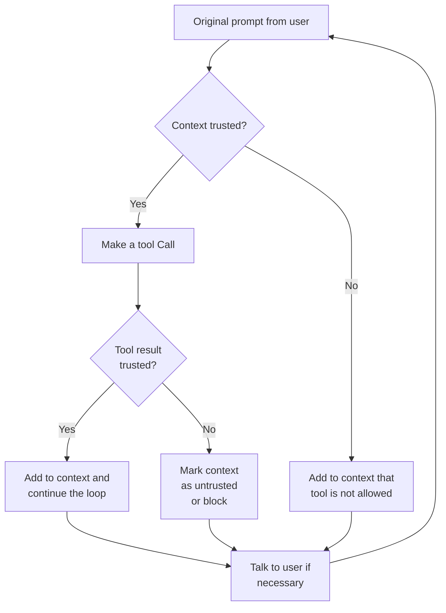

<!-- 
Check ../docs_writer_prompt.md before changing this file.

This document is human-built, shouldn't be updated with AI. Don't change anything here.

Exception:
- Screenshot
-->

Dynamic Tools lets Archestra adapt tool access based on what has already entered the model context. The goal is simple: once a tool returns sensitive or unknown content, later tool calls can be restricted automatically.

The UI now centers on two ordered rule sets:

- **Tool Access Rules** decide whether a tool may run in the current context
- **Context Label Rules** classify tool output with labels such as `safe`, `sensitive`, or organization-specific labels

Archestra evaluates rules from top to bottom. The first matching rule wins.

This creates a safer middle ground than fully open agents or permanently read-only agents:

| 🚫 Unsafe Agent                  | 🟢 Safe Agent with **Dynamic Tools**                                               | 🟢 Safe Read-Only Agent          |
| -------------------------------- | ---------------------------------------------------------------------------------- | -------------------------------- |
| ✅ Can access private data       | ✅ Can access private data                                                         | ✅ Can access private data       |
| ✅ Can process untrusted content | ✅ Can process untrusted content                                                   | ✅ Can process untrusted content |
| ✅ Can communicate externally    | 🤖 External communication **dynamically disabled after processing untrusted data** | 🚫 Cannot communicate externally |

## Detect tools

The first step is to configure Archestra as a proxy for your agent's API requests. When your agent executes requests through the Archestra proxy endpoint, the platform automatically discovers and registers any tools included in those requests.

Tool discovery happens transparently:

1. Configure your agent to send requests through Archestra's proxy
2. When your agent makes API calls with tools, Archestra automatically detects them
3. Each tool's name, parameters, and description are extracted and stored
4. No manual tool registration or configuration required

This dynamic discovery allows Archestra to monitor and control tool usage without pre-configuration.

## Classify output

Archestra uses **Context Label Rules** to classify tool output before it is returned to the model.

Two labels are provided by default:

- `safe`
- `sensitive`

You can add more suggested labels in **Settings → Organization**. These labels become reusable building blocks for access rules.

The important default is unchanged:

- if no result rule matches, the output is treated as `sensitive`

This means unknown tool output does not silently upgrade the context to trusted.

## Decide what can run next

After each tool result is labeled, Archestra evaluates **Tool Access Rules** for subsequent tool calls.

Typical patterns:

- allow read-only tools even when `sensitive` is present
- block write or external communication tools when `sensitive` is present
- require approval for tools that are acceptable in chat but not for autonomous runs

Templates can inspect:

- tool input
- tool output
- context metadata such as `externalAgentId` and `teamIds`
- current context labels with helpers like `{{hasLabel labels "sensitive"}}`

## Rule model

Each rule has three parts:

1. A Handlebars condition template
2. An action
3. An optional explanation shown to admins

The first matching rule wins, so most teams use:

1. Specific exceptions at the top
2. A broad default at the bottom

For result classification, the most common action is `assign_labels`. Legacy `mark_as_trusted` and `mark_as_untrusted` still work, but they are treated as compatibility aliases for labeling output `safe` or `sensitive`.

## Trust model

Archestra no longer flips the whole conversation to trusted because one rule says "mark trusted". Instead, context trust is derived from labels:

- if any current context data is labeled `sensitive`, sensitive-context protections apply
- if no sensitive labels remain, standard tool access continues

This keeps the model straightforward: rules classify output, and access rules react to those labels.
